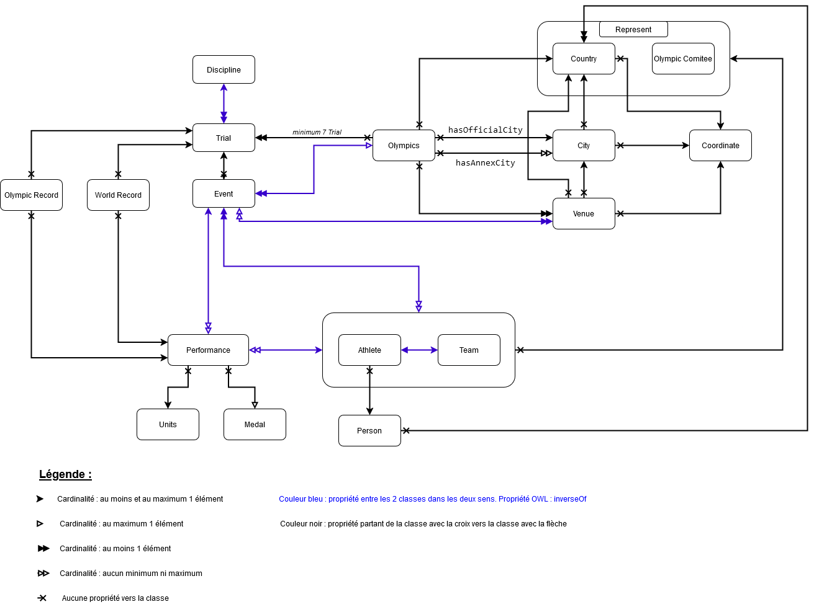

# Rapport d'analyse du RDFS

## 1. Introduction

Le graph RDFS représenté ci-dessous couvre les relations entre les différentes classes d'un modèle de données ainsi que les propriétés qui les lient, en tenant compte de diverses règles de cardinalité et de contraintes d'intégrité. L'objectif est de faciliter la compréhension des interactions entre les objets du système et d'assurer la cohérence et la validité des données.



## 2. Analyse du graphe RDFS

Le graphe met en évidence les classes principales et les relations qui les unissent. Les flèches entre les entités représentent les propriétés, avec des distinctions en fonction de la cardinalité et des types de propriétés (fonctionnelles, transitives, inverses, etc.).

Les classes clés identifiées incluent notamment (liste non exhaustive) :

- `:Country`, `:City`, `:Venue`, `:Discipline`, `:Trial`, `:Event` : Ces classes sont mutuellement disjointes, assurant qu'un même objet ne puisse appartenir à plusieurs d'entre elles simultanément.
- `:Person` : Définie comme équivalente à `schema:Person` et disjointe de `:Team` et `:Athlete`, permettant une classification stricte des entités humaines.
- `:Venue` : Dotée d'une clé unique `:hasCoordinate`, garantissant une identification unique d'un lieu.
- `:Performance` : Définie avec une clé basée sur `:playedBy`, `:hasEvent`, `:isScheduledAtTime` pour garantir l'unicité des performances enregistrées.
- `:Coordinate` : Clé définie par `:hasLatitude` et `:hasLongitude`, avec des restrictions sur les valeurs acceptables.

Les contraintes de cardinalité appliquées, telles que `isDisabled` et `hasCountry`, permettent d'encadrer les relations entre les entités. Par exemple, une ville ne peut être associée qu'à un seul et unique pays (`owl:cardinality 1`).

## 3. Utilisation des OWL et SHACL

Afin d'assurer l'intégrité et la précision des données modélisées, plusieurs axiomes OWL et contraintes SHACL ont été appliqués. Cette section décrit les règles OWL utilisées pour renforcer la sémantique du modèle de données.

### 3.1 OWL (Web Ontology Language)

Le langage OWL est utilisé pour enrichir les ontologies avec des règles logiques et des restrictions. Les concepts et propriétés suivants illustrent son utilisation dans notre modèle :

#### 1. Disjonction des classes

Déclaration que certaines classes (ex. : Country, City, etc.) sont mutuellement exclusives :

```ttl
[] rdf:type owl:AllDisjointClasses ;  
   owl:members ( :Country :City :Venue :Discipline :Trial :Event ) .  
```

**Explication :**
- Cette déclaration garantit qu'un objet ne peut appartenir simultanément à plusieurs de ces classes. Par exemple, un même individu ne peut pas être à la fois une Country (pays) et une City (ville).

---

#### 2. Propriétés fonctionnelles et inversement fonctionnelles

Exemple de propriété inversement fonctionnelle :

```ttl
:hasCode a owl:InverseFunctionalProperty .
```

**Explication :**
- Une propriété inversement fonctionnelle (comme `hasCode`) garantit qu'une valeur donnée de cette propriété (ex. : un code de pays unique) correspond à un seul individu.

Exemple de propriété fonctionnelle :

```ttl
:hasCountry a owl:FunctionalProperty .
```

**Explication :**
- Une propriété fonctionnelle garantit qu'un individu peut être lié à une seule valeur par cette propriété. Par exemple, un événement (Event) ne peut être associé qu'à un seul pays (Country).

---

#### 3. Propriétés inverses et transitives

Exemple de propriétés inverses :

```ttl
:locatedIn owl:inverseOf :hasLocation .
```

**Explication :**
- Si un objet A est lié à un objet B par la propriété `locatedIn`, alors l'objet B est lié à l'objet A par `hasLocation`.

Exemple de propriété transitive :

```ttl
:isPartOf a owl:TransitiveProperty .
```

**Explication :**
- Si A est une partie de B, et B est une partie de C, alors A est également une partie de C (ex. : un quartier est partie d'une ville, qui est partie d'un pays).

---

#### 4. Propriétés avec restrictions de valeur

Exemple :

```ttl
:height rdf:type owl:DatatypeProperty ;  
        rdfs:range [  
            a rdfs:Datatype ;  
            owl:onDatatype xsd:decimal ;  
            owl:withRestrictions (  
                [ xsd:minInclusive "0"^^xsd:decimal ]  
            )  
        ] .  
```

**Explication :**
- La propriété `height` (hauteur) est définie comme un type de donnée (DatatypeProperty) avec une plage de valeurs (range) spécifiée. Ici, elle doit être un nombre décimal (`xsd:decimal`) et doit être supérieure ou égale à 0.

---

#### 5. Définition de clé

Exemple :

```ttl
:Coordinate owl:hasKey ( :hasLatitude :hasLongitude ) .
```

**Explication :**
- Cette déclaration définit une clé unique pour les instances de la classe `Coordinate`, basée sur les propriétés `hasLatitude` et `hasLongitude`. Cela signifie que deux objets ne peuvent pas avoir à la fois les mêmes latitude et longitude.

---

#### 6. Union de classes

Exemple :

```ttl
:Athlete owl:unionOf ( :ProfessionalAthlete :AmateurAthlete ) .
```

**Explication :**
- La classe `Athlete` est définie comme l'union des classes `ProfessionalAthlete` (athlète professionnel) et `AmateurAthlete` (athlète amateur). Tout individu appartenant à l'une de ces deux classes est automatiquement considéré comme un `Athlete`.

---

#### 7. Cardinalité minimale

Exemple :

```ttl
rdfs:subClassOf [  
    a owl:Restriction ;  
    owl:onProperty :hasMember ;  
    owl:minCardinality "1"^^xsd:nonNegativeInteger  
] .  
```

**Explication :**
- Cette restriction impose qu'un individu lié par la propriété `hasMember` doit avoir au moins un membre. Par exemple, une classe représentant une équipe doit toujours contenir au moins un membre.


### 3.2 SHACL (Shapes Constraint Language)

Le langage SHACL est utilisé pour définir et valider des contraintes sur les données RDF. Ces contraintes permettent d'assurer que les données respectent des règles métier précises et cohérentes avec le modèle. Les exemples ci-dessous illustrent l'utilisation de SHACL dans ce projet. Il s'agit d'une liste non exhaustive.

#### 1. Validation de l'appartenance d'un trial à une discipline

```ttl
sh:sparql [
    sh:message "A trial must belong to a discipline, and that discipline must include the trial." ;
    sh:select """
        SELECT $this
        WHERE {
            FILTER NOT EXISTS {
                $this :belongsToDiscipline ?discipline .
                ?discipline :disciplineHasTrial $this .
            }
        }
    """ ;
] ;
```

**Explication :**
- Cette contrainte vérifie qu'un trial (:Trial) appartient bien à une discipline (:Discipline) et que cette discipline inclut également le trial.
- Si ce lien bidirectionnel n'est pas respecté, un message d'erreur est généré.

---

#### 2. Vérification des médailles en fonction des rangs

```ttl
sh:sparql [
    sh:message "If the rank is 3 or greater, a medal must be awarded. If the rank is less than 3, no medal can be awarded." ;
    sh:select """
        SELECT $this
        WHERE {
            $this :rank ?rank .
            OPTIONAL { $this :awarded ?medal . }
            FILTER (
                (?rank >= 3 && !BOUND(?medal)) ||
                (?rank < 3 && BOUND(?medal))
            )
        }
    """ ;
] ;
```

**Explication :**
- Cette contrainte impose que :
  - Si le rang (:rank) est supérieur ou égal à 3, une médaille (:awarded) doit être attribuée.
  - Si le rang est inférieur à 3, aucune médaille ne doit être attribuée.
- Elle assure ainsi une cohérence entre les rangs et les récompenses.

---

#### 3. Correspondance des médailles avec les rangs

```ttl
sh:sparql [
    sh:message "If the rank is 1, the medal must be Gold; if 2, the medal must be Silver; if 3, the medal must be Bronze." ;
    sh:select """
        SELECT $this
        WHERE {
            $this :rank ?rank ;
                  :awarded ?medal .
            FILTER (
                (?rank = 1 && ?medal != :Gold) ||
                (?rank = 2 && ?medal != :Silver) ||
                (?rank = 3 && ?medal != :Bronze)
            )
        }
    """ ;
] ;
```

**Explication :**
- Cette contrainte s'assure que :
  - Une médaille d'or est attribuée au premier rang.
  - Une médaille d'argent est attribuée au deuxième rang.
  - Une médaille de bronze est attribuée au troisième rang.
- Si une correspondance incorrecte est détectée, la contrainte renvoie une erreur.

---

#### 4. Correspondance des dates d'un événement avec son horaire

```ttl
sh:sparql [
    sh:message "The day, month, and year of :isScheduledAtTime must match the :hasDate of the associated :hasEvent." ;
    sh:select """
        SELECT $this
        WHERE {
            $this :isScheduledAtTime ?scheduledTime ;
                  :hasEvent ?event .
            ?event :hasDate ?eventDate .
            FILTER (
                (YEAR(?scheduledTime) != YEAR(?eventDate)) ||
                (MONTH(?scheduledTime) != MONTH(?eventDate)) ||
                (DAY(?scheduledTime) != DAY(?eventDate))
            )
        }
    """ ;
] ;
```

**Explication :**
- Cette contrainte valide que la date (:hasDate) d'un événement (:hasEvent) correspond à l'année, au mois et au jour de l'horaire planifié (:isScheduledAtTime).

---

#### 5. Cohérence entre les pays d'une ville et de son lieu

```ttl
sh:sparql [
    sh:message "The country of the venue must be the same as the country of its city." ;
    sh:select """
        SELECT $this
        WHERE {
            $this :hasCity ?city .
            $this :hasCountry ?venueCountry .
            ?city :hasCountry ?cityCountry .
            FILTER (?venueCountry != ?cityCountry)
        }
    """ ;
] ;
```

**Explication :**
- Cette règle garantit que le pays (:hasCountry) d'un lieu (:Venue) est le même que le pays associé à la ville (:City) du lieu.
- Si une divergence est trouvée, une alerte est générée.

---

#### 6. Cohérence entre un athlète et son équipe

```ttl
sh:sparql [
    sh:message "If an athlete is part of a team, they must have the same values for 'isDisabled', 'represent', and 'participatesIn' as the team." ;
    sh:select """
        SELECT $this
        WHERE {
            $this :isPartOfTeam ?team .
            $this :isDisabled ?athleteDisabled .
            $this :represent ?athleteRepresent .
            $this :participatesIn ?athleteEvent .
            
            ?team :isDisabled ?teamDisabled .
            ?team :represent ?teamRepresent .
            ?team :participatesIn ?teamEvent .

            FILTER (?athleteDisabled != ?teamDisabled || 
                    ?athleteRepresent != ?teamRepresent || 
                    ?athleteEvent != ?teamEvent)
        }
    """ ;
] ;
```

**Explication :**
- Cette contrainte s'assure qu'un athlète (:Athlete) partage les mêmes caractéristiques que son équipe (:Team), notamment :
  - L'état de handicap (:isDisabled).
  - La représentation (:represent).
  - Les événements auxquels ils participent (:participatesIn).
- Cela permet de maintenir une cohérence entre les athlètes et leurs équipes.

## 4. Conclusion

L'utilisation combinée de RDFS, OWL et SHACL permet d'assurer une modélisation riche et précise des données, garantissant la cohérence et l'intégrité des relations entre entités. Les règles appliquées offrent des garanties de validation des données tout en facilitant l'interopérabilité avec d'autres systèmes de données sémantiques.


