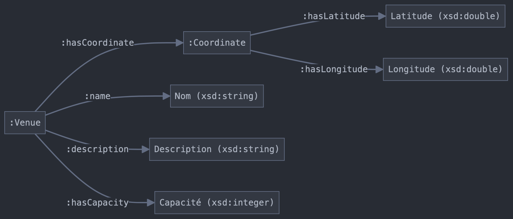
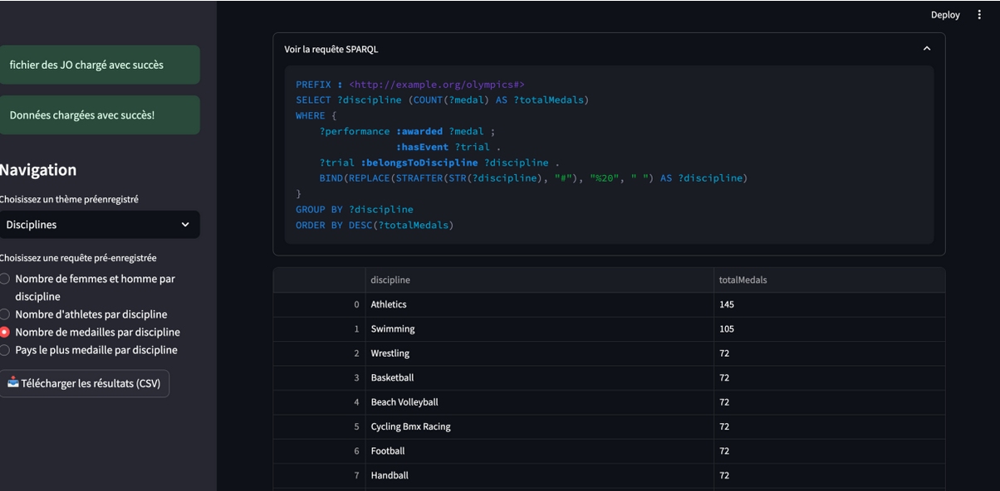
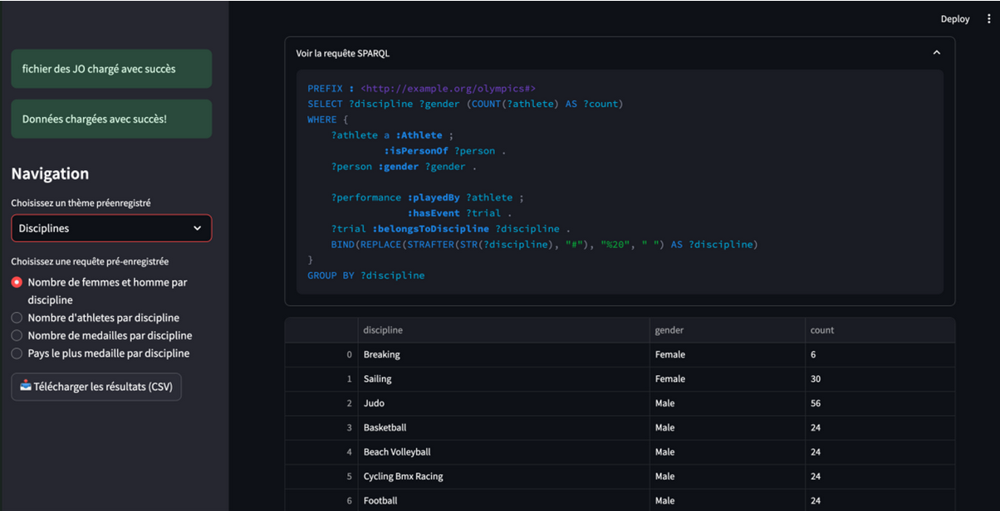

# Rapport FINAL JO - Guillaume ARRIGONI, Timothée JUILLET, Salma TALIB

## Sommaire

- [Rapport FINAL JO - Guillaume ARRIGONI, Timothée JUILLET, Salma TALIB](#rapport-final-jo---guillaume-arrigoni-timothée-juillet-salma-talib)
  - [Sommaire](#sommaire)
  - [Analyse du RDFS](#analyse-du-rdfs)
    - [1. Introduction](#1-introduction)
    - [2. Analyse du graphe RDFS](#2-analyse-du-graphe-rdfs)
    - [3. Utilisation des OWL et SHACL](#3-utilisation-des-owl-et-shacl)
      - [3.1 OWL (Web Ontology Language)](#31-owl-web-ontology-language)
        - [1. Disjonction des classes](#1-disjonction-des-classes)
        - [2. Propriétés fonctionnelles et inversement fonctionnelles](#2-propriétés-fonctionnelles-et-inversement-fonctionnelles)
        - [3. Propriétés inverses et transitives](#3-propriétés-inverses-et-transitives)
        - [4. Propriétés avec restrictions de valeur](#4-propriétés-avec-restrictions-de-valeur)
        - [5. Définition de clé](#5-définition-de-clé)
        - [6. Union de classes](#6-union-de-classes)
        - [7. Cardinalité minimale](#7-cardinalité-minimale)
      - [3.2 SHACL (Shapes Constraint Language)](#32-shacl-shapes-constraint-language)
        - [1. Validation de l'appartenance d'un trial à une discipline](#1-validation-de-lappartenance-dun-trial-à-une-discipline)
        - [2. Vérification des médailles en fonction des rangs](#2-vérification-des-médailles-en-fonction-des-rangs)
        - [3. Correspondance des médailles avec les rangs](#3-correspondance-des-médailles-avec-les-rangs)
        - [4. Correspondance des dates d'un événement avec son horaire](#4-correspondance-des-dates-dun-événement-avec-son-horaire)
        - [5. Cohérence entre les pays d'une ville et de son lieu](#5-cohérence-entre-les-pays-dune-ville-et-de-son-lieu)
        - [6. Cohérence entre un athlète et son équipe](#6-cohérence-entre-un-athlète-et-son-équipe)
    - [4. Conclusion](#4-conclusion)
  - [Conception et implémentation du micro-service](#conception-et-implémentation-du-micro-service)
    - [Transformation des données et gestion des identifiants](#transformation-des-données-et-gestion-des-identifiants)
    - [Structuration des coordonnées géographiques](#structuration-des-coordonnées-géographiques)
  - [Modélisation des connaissances avec SKOS](#modélisation-des-connaissances-avec-skos)
    - [Organisation des schémas conceptuels](#organisation-des-schémas-conceptuels)
    - [Relations hiérarchiques et sémantiques clés](#relations-hiérarchiques-et-sémantiques-clés)
    - [Multilinguisme et définitions](#multilinguisme-et-définitions)
    - [Contraintes et notes de portée](#contraintes-et-notes-de-portée)
  - [Extraction et transformation des connaissances](#extraction-et-transformation-des-connaissances)
    - [1. Extraction des triplets avec REBEL](#1-extraction-des-triplets-avec-rebel)
    - [2. Conversion en RDF](#2-conversion-en-rdf)
    - [3. Enrichissement sémantique](#3-enrichissement-sémantique)
  - [Rêquetes SPARQL :](#rêquetes-sparql-)
    - [Exemple de Requête SPARQL :](#exemple-de-requête-sparql-)
      - [Nombre de Médailles par Discipline :](#nombre-de-médailles-par-discipline-)
      - [Nombre de Femmes et Hommes par Discipline :](#nombre-de-femmes-et-hommes-par-discipline-)
    - [Requêtes sur le micro-service SPARQL](#requêtes-sur-le-micro-service-sparql)
      - [Requêtes directes au micro-service](#requêtes-directes-au-micro-service)
      - [Requête fédérée](#requête-fédérée)

## Analyse du RDFS

### 1. Introduction

Le graph RDFS représenté ci-dessous couvre les relations entre les différentes classes d'un modèle de données ainsi que les propriétés qui les lient, en tenant compte de diverses règles de cardinalité et de contraintes d'intégrité. L'objectif est de faciliter la compréhension des interactions entre les objets du système et d'assurer la cohérence et la validité des données.


### 2. Analyse du graphe RDFS

Le graphe met en évidence les classes principales et les relations qui les unissent. Les flèches entre les entités représentent les propriétés, avec des distinctions en fonction de la cardinalité et des types de propriétés (fonctionnelles, transitives, inverses, etc.).

Les classes clés identifiées incluent notamment (liste non exhaustive) :

- `:Country`, `:City`, `:Venue`, `:Discipline`, `:Trial`, `:Event` : Ces classes sont mutuellement disjointes, assurant qu'un même objet ne puisse appartenir à plusieurs d'entre elles simultanément.
- `:Person` : Définie comme équivalente à `schema:Person` et disjointe de `:Team` et `:Athlete`, permettant une classification stricte des entités humaines.
- `:Venue` : Dotée d'une clé unique `:hasCoordinate`, garantissant une identification unique d'un lieu.
- `:Performance` : Définie avec une clé basée sur `:playedBy`, `:hasEvent`, `:isScheduledAtTime` pour garantir l'unicité des performances enregistrées.
- `:Coordinate` : Clé définie par `:hasLatitude` et `:hasLongitude`, avec des restrictions sur les valeurs acceptables.

Les contraintes de cardinalité appliquées, telles que `isDisabled` et `hasCountry`, permettent d'encadrer les relations entre les entités. Par exemple, une ville ne peut être associée qu'à un seul et unique pays (`owl:cardinality 1`).

### 3. Utilisation des OWL et SHACL

Afin d'assurer l'intégrité et la précision des données modélisées, plusieurs axiomes OWL et contraintes SHACL ont été appliqués. Cette section décrit les règles OWL utilisées pour renforcer la sémantique du modèle de données.

#### 3.1 OWL (Web Ontology Language)

Le langage OWL est utilisé pour enrichir les ontologies avec des règles logiques et des restrictions. Les concepts et propriétés suivants illustrent son utilisation dans notre modèle :

##### 1. Disjonction des classes

Déclaration que certaines classes (ex. : Country, City, etc.) sont mutuellement exclusives :

```ttl
[] rdf:type owl:AllDisjointClasses ;  
   owl:members ( :Country :City :Venue :Discipline :Trial :Event ) .  
```

**Explication :**
- Cette déclaration garantit qu'un objet ne peut appartenir simultanément à plusieurs de ces classes. Par exemple, un même individu ne peut pas être à la fois une Country (pays) et une City (ville).

---

##### 2. Propriétés fonctionnelles et inversement fonctionnelles

Exemple de propriété inversement fonctionnelle :

```ttl
:hasCode a owl:InverseFunctionalProperty .
```

**Explication :**
- Une propriété inversement fonctionnelle (comme `hasCode`) garantit qu'une valeur donnée de cette propriété (ex. : un code de pays unique) correspond à un seul individu.

Exemple de propriété fonctionnelle :

```ttl
:hasCountry a owl:FunctionalProperty .
```

**Explication :**
- Une propriété fonctionnelle garantit qu'un individu peut être lié à une seule valeur par cette propriété. Par exemple, un événement (Event) ne peut être associé qu'à un seul pays (Country).

---

##### 3. Propriétés inverses et transitives

Exemple de propriétés inverses :

```ttl
:locatedIn owl:inverseOf :hasLocation .
```

**Explication :**
- Si un objet A est lié à un objet B par la propriété `locatedIn`, alors l'objet B est lié à l'objet A par `hasLocation`.

Exemple de propriété transitive :

```ttl
:isPartOf a owl:TransitiveProperty .
```

**Explication :**
- Si A est une partie de B, et B est une partie de C, alors A est également une partie de C (ex. : un quartier est partie d'une ville, qui est partie d'un pays).

---

##### 4. Propriétés avec restrictions de valeur

Exemple :

```ttl
:height rdf:type owl:DatatypeProperty ;  
        rdfs:range [  
            a rdfs:Datatype ;  
            owl:onDatatype xsd:decimal ;  
            owl:withRestrictions (  
                [ xsd:minInclusive "0"^^xsd:decimal ]  
            )  
        ] .  
```

**Explication :**
- La propriété `height` (hauteur) est définie comme un type de donnée (DatatypeProperty) avec une plage de valeurs (range) spécifiée. Ici, elle doit être un nombre décimal (`xsd:decimal`) et doit être supérieure ou égale à 0.

---

##### 5. Définition de clé

Exemple :

```ttl
:Coordinate owl:hasKey ( :hasLatitude :hasLongitude ) .
```

**Explication :**
- Cette déclaration définit une clé unique pour les instances de la classe `Coordinate`, basée sur les propriétés `hasLatitude` et `hasLongitude`. Cela signifie que deux objets ne peuvent pas avoir à la fois les mêmes latitude et longitude.

---

##### 6. Union de classes

Exemple :

```ttl
:Athlete owl:unionOf ( :ProfessionalAthlete :AmateurAthlete ) .
```

**Explication :**
- La classe `Athlete` est définie comme l'union des classes `ProfessionalAthlete` (athlète professionnel) et `AmateurAthlete` (athlète amateur). Tout individu appartenant à l'une de ces deux classes est automatiquement considéré comme un `Athlete`.

---

##### 7. Cardinalité minimale

Exemple :

```ttl
rdfs:subClassOf [  
    a owl:Restriction ;  
    owl:onProperty :hasMember ;  
    owl:minCardinality "1"^^xsd:nonNegativeInteger  
] .  
```

**Explication :**
- Cette restriction impose qu'un individu lié par la propriété `hasMember` doit avoir au moins un membre. Par exemple, une classe représentant une équipe doit toujours contenir au moins un membre.


#### 3.2 SHACL (Shapes Constraint Language)

Le langage SHACL est utilisé pour définir et valider des contraintes sur les données RDF. Ces contraintes permettent d'assurer que les données respectent des règles métier précises et cohérentes avec le modèle. Les exemples ci-dessous illustrent l'utilisation de SHACL dans ce projet. Il s'agit d'une liste non exhaustive.

##### 1. Validation de l'appartenance d'un trial à une discipline

```ttl
sh:sparql [
    sh:message "A trial must belong to a discipline, and that discipline must include the trial." ;
    sh:select """
        SELECT $this
        WHERE {
            FILTER NOT EXISTS {
                $this :belongsToDiscipline ?discipline .
                ?discipline :disciplineHasTrial $this .
            }
        }
    """ ;
] ;
```

**Explication :**
- Cette contrainte vérifie qu'un trial (:Trial) appartient bien à une discipline (:Discipline) et que cette discipline inclut également le trial.
- Si ce lien bidirectionnel n'est pas respecté, un message d'erreur est généré.

---

##### 2. Vérification des médailles en fonction des rangs

```ttl
sh:sparql [
    sh:message "If the rank is 3 or greater, a medal must be awarded. If the rank is less than 3, no medal can be awarded." ;
    sh:select """
        SELECT $this
        WHERE {
            $this :rank ?rank .
            OPTIONAL { $this :awarded ?medal . }
            FILTER (
                (?rank >= 3 && !BOUND(?medal)) ||
                (?rank < 3 && BOUND(?medal))
            )
        }
    """ ;
] ;
```

**Explication :**
- Cette contrainte impose que :
  - Si le rang (:rank) est supérieur ou égal à 3, une médaille (:awarded) doit être attribuée.
  - Si le rang est inférieur à 3, aucune médaille ne doit être attribuée.
- Elle assure ainsi une cohérence entre les rangs et les récompenses.

---

##### 3. Correspondance des médailles avec les rangs

```ttl
sh:sparql [
    sh:message "If the rank is 1, the medal must be Gold; if 2, the medal must be Silver; if 3, the medal must be Bronze." ;
    sh:select """
        SELECT $this
        WHERE {
            $this :rank ?rank ;
                  :awarded ?medal .
            FILTER (
                (?rank = 1 && ?medal != :Gold) ||
                (?rank = 2 && ?medal != :Silver) ||
                (?rank = 3 && ?medal != :Bronze)
            )
        }
    """ ;
] ;
```

**Explication :**
- Cette contrainte s'assure que :
  - Une médaille d'or est attribuée au premier rang.
  - Une médaille d'argent est attribuée au deuxième rang.
  - Une médaille de bronze est attribuée au troisième rang.
- Si une correspondance incorrecte est détectée, la contrainte renvoie une erreur.

---

##### 4. Correspondance des dates d'un événement avec son horaire

```ttl
sh:sparql [
    sh:message "The day, month, and year of :isScheduledAtTime must match the :hasDate of the associated :hasEvent." ;
    sh:select """
        SELECT $this
        WHERE {
            $this :isScheduledAtTime ?scheduledTime ;
                  :hasEvent ?event .
            ?event :hasDate ?eventDate .
            FILTER (
                (YEAR(?scheduledTime) != YEAR(?eventDate)) ||
                (MONTH(?scheduledTime) != MONTH(?eventDate)) ||
                (DAY(?scheduledTime) != DAY(?eventDate))
            )
        }
    """ ;
] ;
```

**Explication :**
- Cette contrainte valide que la date (:hasDate) d'un événement (:hasEvent) correspond à l'année, au mois et au jour de l'horaire planifié (:isScheduledAtTime).

---

##### 5. Cohérence entre les pays d'une ville et de son lieu

```ttl
sh:sparql [
    sh:message "The country of the venue must be the same as the country of its city." ;
    sh:select """
        SELECT $this
        WHERE {
            $this :hasCity ?city .
            $this :hasCountry ?venueCountry .
            ?city :hasCountry ?cityCountry .
            FILTER (?venueCountry != ?cityCountry)
        }
    """ ;
] ;
```

**Explication :**
- Cette règle garantit que le pays (:hasCountry) d'un lieu (:Venue) est le même que le pays associé à la ville (:City) du lieu.
- Si une divergence est trouvée, une alerte est générée.

---

##### 6. Cohérence entre un athlète et son équipe

```ttl
sh:sparql [
    sh:message "If an athlete is part of a team, they must have the same values for 'isDisabled', 'represent', and 'participatesIn' as the team." ;
    sh:select """
        SELECT $this
        WHERE {
            $this :isPartOfTeam ?team .
            $this :isDisabled ?athleteDisabled .
            $this :represent ?athleteRepresent .
            $this :participatesIn ?athleteEvent .
            
            ?team :isDisabled ?teamDisabled .
            ?team :represent ?teamRepresent .
            ?team :participatesIn ?teamEvent .

            FILTER (?athleteDisabled != ?teamDisabled || 
                    ?athleteRepresent != ?teamRepresent || 
                    ?athleteEvent != ?teamEvent)
        }
    """ ;
] ;
```

**Explication :**
- Cette contrainte s'assure qu'un athlète (:Athlete) partage les mêmes caractéristiques que son équipe (:Team), notamment :
  - L'état de handicap (:isDisabled).
  - La représentation (:represent).
  - Les événements auxquels ils participent (:participatesIn).
- Cela permet de maintenir une cohérence entre les athlètes et leurs équipes.

### 4. Conclusion

L'utilisation combinée de RDFS, OWL et SHACL permet d'assurer une modélisation riche et précise des données, garantissant la cohérence et l'intégrité des relations entre entités. Les règles appliquées offrent des garanties de validation des données tout en facilitant l'interopérabilité avec d'autres systèmes de données sémantiques.

## Conception et implémentation du micro-service

### Transformation des données et gestion des identifiants

La transformation des données de l'API vers notre modèle RDF nécessite une attention particulière sur plusieurs aspects techniques, en particulier sur le choix des identifiants et la gestion de cactères spéciaux.

Le mapping JSON-LD établit une structure d'identifiant composite pour chaque venue :

```json
"@id": "venue/{inst_nom}_{equip_nom}_{equip_trib_nb}"
```

Cette structure triple permet d'éviter les collisions potentielles entre les stades ayant des noms similaires en combinant :

- Le nom de l'installation (`inst_nom`)
- Le nom spécifique de l'équipement (`equip_nom`)
- La capacité (`equip_trib_nb`)

En effet, contrairement à une api classique comme celle de pokemon (pokeapi), si je cherche STADE DE FRANCE, je peux avoir plusieurs stades de France avec des capacités et des équipements différents. Le choix de l'identifiant composite permet de garantir l'unicité des URIs tout en conservant une structure logique et compréhensible. De plus nous avons fait le choix de modélisation de ne garder que la version du stade ayant la capacité minimale.

Dans notre requête CONSTRUCT, nous avons implémenté une gestion robuste des espaces et caractères spéciaux :

```sparql
BIND(IRI(CONCAT("http://example.org/olympics#", 
     ENCODE_FOR_URI(?name), "_", 
     ENCODE_FOR_URI(?desc))) AS ?venue)
```

L'utilisation de `ENCODE_FOR_URI` garantit que les espaces et caractères spéciaux (comme dans "STADE DE FRANCE" ou "STADE D'ATHLETISME") sont correctement encodés dans les URIs générées. Cependant même avec cela l'utilisation de Corese devient impossible, l'outil ne supportant pas les espaces. Notre code final devra donc être en python uniquement.

### Structuration des coordonnées géographiques

Le profile JSON-LD définit une structure spécifique :

```json
"coordonnees": {
    "@type": "@id",
    "lat": {
        "@id": "http://example.org/schema#equip_y",
        "@type": "xsd:double"
    },
    "lon": {
        "@id": "http://example.org/schema#equip_x",
        "@type": "xsd:double"
    }
}
```

Cette approche permet de :

1. Garantir la précision des données avec le type `xsd:double`
2. Faciliter les futures requêtes géospatiales, nous permettant plus tard de faire apparaitre sur une carte la position des stades.

Comme le montre la réponse pour le Stade de France, cette structure génère des triplets RDF clairement organisés :

```turtle
:STADE%20DE%20FRANCE_STADE%20%20D%27ATHLETISME 
    :hasCoordinate :STADE%20DE%20FRANCE_Position ;
    :hasCapacity "75000"^^xsd:integer .

:STADE%20DE%20FRANCE_Position 
    a :Coordinate ;
    :hasLatitude "48.925"^^xsd:double ;
    :hasLongitude "2.3605"^^xsd:double .
```

Voici la structure complèete de notre modélisation :



## Modélisation des connaissances avec SKOS

Notre modèle SKOS structure les concepts clés des Jeux Olympiques en trois schémas conceptuels distincts, permettant une organisation hiérarchique et sémantique claire des données.

### Organisation des schémas conceptuels

Nous avons défini trois `skos:ConceptScheme` principaux :

1. **OlympicsScheme** : Structure centrale organisant les concepts fondamentaux des JO
2. **GeographyScheme** : Gestion des aspects géographiques et des infrastructures
3. **PerformanceScheme** : Organisation des concepts liés aux résultats sportifs

Cette séparation permet une gestion des concepts principaux tout en maintenant leurs relations sémantiques.

### Relations hiérarchiques et sémantiques clés

Notre modèle établit plusieurs relations hiérarchiques significatives :

```turtle
:Event skos:broader :Trial
:Trial skos:broader :Discipline
:Venue skos:broader :City
:City skos:broader :Country
```

Des relations transversales enrichissent la sémantique du modèle :
```turtle
:Team skos:related :Athlete
:Performance skos:related :Event
:Country skos:related :City
```

### Multilinguisme et définitions

Le modèle intègre systématiquement un support bilingue français-anglais pour chaque concept :

```turtle
:Venue a skos:Concept ;
    skos:prefLabel "Venue"@en ;
    skos:prefLabel "Lieu"@fr ;
    skos:altLabel "Event Venue"@en ;
    skos:altLabel "Lieu de l'événement"@fr .
```

### Contraintes et notes de portée

Des contraintes métier sont formalisées via `skos:scopeNote`, par exemple :
```turtle
:Team skos:scopeNote "A team must have at least one member."@en ;
    skos:scopeNote "Une équipe doit avoir au moins un membre."@fr .
```

Pour le contexte géographique :
```turtle
:Venue skos:scopeNote "Venues must include capacity, coordinates, and city information."@en ;
    skos:scopeNote "Les lieux doivent inclure des informations sur la capacité, les coordonnées et la ville."@fr .
```

Cette modélisation SKOS s'aligne parfaitement avec notre micro-service SPARQL précédemment décrit, notamment pour la gestion des lieux olympiques. La structure hiérarchique `Venue → City → Country` correspond directement aux données extraites de l'API des équipements sportifs, permettant une intégration cohérente des données dans notre graphe de connaissances.

## Extraction et transformation des connaissances

Notre approche d'extraction et de transformation des connaissances s'articule en trois étapes principales.

### 1. Extraction des triplets avec REBEL

Nous avons implémenté un extracteur de triplets basé sur le modèle REBEL (Babelscape/rebel-large) qui permet d'extraire des relations sémantiques à partir de textes non structurés. Notre implémentation :

- Découpe le texte en phrases via NLTK
- Traite chaque chunk avec le modèle REBEL
- Extrait les triplets (sujet, relation, objet)
- Sauvegarde les résultats dans un format CSV

Les triplets extraits mettent en évidence les relations clés, par exemple :

```csv
head,type,tail
"Jeux olympiques d'été de 2024","point in time","2024"
"Jeux olympiques d'été de 2024","located in","Paris"
"Novak Djokovic","sport","tennis"
```

### 2. Conversion en RDF

La conversion des triplets en RDF est gérée par une classe dédiée qui :

1. **Nettoie et normalise les données** :

```python
def clean_text(self, text):
    text = text.lower().strip()
    text = re.sub(r'[^\w\s-]', '', text)
    text = re.sub(r'[-\s]+', '_', text)
    return text
```

1. **Gère les ressources de manière cohérente** :

- Création d'URIs uniques pour chaque entité
- Déduplication des triplets
- Typage explicite des ressources

1. **Effectue des mappings spécifiques** :

- Conversion des dates au format XSD
- Attribution des types (Olympics, Athlete, Country)
- Gestion des relations spécifiques au domaine olympique

### 3. Enrichissement sémantique

L'enrichissement final est une touche supplémentaire pour que les informations extraites respectent notre modèle ontologique et soient prêtes pour l'interrogation SPARQL. Par exemple :

1. **Enrichissement des disciplines** :

```turtle
olympics:tennis_singles a olympics:Trial ;
    rdfs:label "Tennis Singles" ;
    olympics:belongsToDiscipline olympics:tennis ;
    olympics:isDisabled false ;
    olympics:isTeamTrial false .
```

2. **Enrichissement des athlètes** :

```turtle
olympics:novak_djokovic a olympics:Athlete ;
    olympics:birthDate "1987-05-22"^^xsd:date ;
    olympics:height 188 ;
    olympics:hasNationality olympics:serbia .
```

3. **Structure des Jeux Olympiques** :

```turtle
olympics:jeux_olympiques_dété_de_2024
    olympics:hasOfficialCity olympics:paris ;
    olympics:hasTrial olympics:athletic_100m, olympics:tennis_singles ;
    olympics:season "Summer" .
```

Cette approche en trois étapes permet de :
- Extraire efficacement les connaissances des textes non structurés
- Assurer la cohérence avec notre modèle ontologique
- Enrichir les données avec des informations métier spécifiques

Le résultat final est un graphe RDF riche et structuré, prêt à être interrogé via SPARQL et aligné avec d'autres sources de données du Web sémantique.

## Rêquetes SPARQL :

Pour explorer efficacement les données structurées des Jeux Olympiques de Paris 2024, nous avons employé des requêtes SPARQL, qui permet d'extraire, de manipuler et de combiner des informations issues de notre vaste graphe RDF. Cette section présente quelques exemples de requêtes SPARQL conçues pour répondre à des questions spécifiques sur les performances des athlètes, les médailles attribuées et les détails disciplinaires des événements olympiques. 

### Exemple de Requête SPARQL :

#### Nombre de Médailles par Discipline :

La requête SPARQL suivante est conçue pour calculer le nombre total de médailles attribuées dans chaque discipline sportive pendant les Jeux Olympiques de Paris 2024. Elle illustre l'usage de fonctions d'agrégation et de groupement dans SPARQL pour déduire des données issues de plusieurs entités connectées.

Explication de la Requête :

- **PREFIX** : Définit l'espace de noms pour toutes les entités utilisées dans la requête, simplifiant ainsi la syntaxe des triplets SPARQL.
- **SELECT** : Spécifie les variables à afficher dans les résultats, ici le nom de la discipline et le total des médailles.
- **WHERE** : Contient un motif de graphique qui lie les performances aux médailles et les performances aux événements, qui à leur tour sont liés à une discipline.
- **BIND** : Utilisé pour nettoyer et formater les noms des disciplines en remplaçant les échappements d'URL par des espaces pour une meilleure lisibilité.
- **GROUP BY** : Regroupe les résultats par discipline sportive.
- **ORDER BY** : Trie les disciplines par le nombre décroissant de médailles pour mettre en avant les sports les plus médaillés.



L'image de l'interface de l'Explorateur SPARQL montre clairement les résultats de cette requête. Les disciplines sont listées avec le nombre correspondant de médailles obtenues, ce qui permet de visualiser rapidement les sports où les compétiteurs ont excellé.

#### Nombre de Femmes et Hommes par Discipline :

La requête SPARQL suivante est conçue pour compter le nombre de femmes et d'hommes participants dans chaque discipline sportive aux Jeux Olympiques de Paris 2024. Cette requête démontre l'utilisation efficace des fonctions d'agrégation et de filtrage de SPARQL pour examiner la diversité de genre au sein des différentes disciplines sportives.

Explication de la Requête :

- **PREFIX** : Définit l'espace de noms pour toutes les entités utilisées dans la requête, ce qui simplifie la syntaxe des triplets SPARQL.
- **SELECT** : Spécifie les variables à afficher dans les résultats, ici le nom de la discipline, le genre des athlètes, et le nombre d'athlètes de chaque genre.
- **WHERE** : Décrit les critères pour sélectionner les athlètes, y compris leur participation à des épreuves qui sont liées à des disciplines spécifiques.
- **BIND** : Utilisé pour nettoyer et formater les noms des disciplines, rendant les résultats plus lisibles pour les utilisateurs.
- **GROUP BY** : Regroupe les résultats par discipline et par genre, permettant une analyse distincte du nombre d'athlètes féminins et masculins.
- **ORDER BY** (non montré dans l'exemple, mais recommandé) : Pourrait être utilisé pour trier les résultats par discipline ou par nombre d'athlètes, facilitant la comparaison entre les genres.



La visualisation des résultats de cette requête dans l'interface de l'Explorateur SPARQL illustre clairement la distribution des genres dans chaque discipline. Cette information est essentielle pour évaluer l'équité et la représentation de genre dans les sports olympiques.

### Requêtes sur le micro-service SPARQL

Notre application exploite les capacités du micro-service SPARQL à travers deux  requêtes : une requête directe et une requêtes fédérée.

#### Requêtes directes au micro-service

La première requête illustre une interrogation directe du service pour obtenir les informations complètes d'un stade :

```sparql
PREFIX : <http://example.org/olympics#>
SELECT * WHERE {
    SERVICE <http://localhost/service/JO/getInfosStade?name=STADE DE FRANCE> {
        ?x ?y ?z
    }
}
```

Bien que la requête semble fixée sur le "STADE DE FRANCE", notre implémentation permet une utilisation dynamique du paramètre "name". Grâce à notre interface, l'utilisateur peut interroger n'importe quelle installation en utilisant le même modèle de requête. Cette approche permet de maintenir la structure de la requête SPARQL tout en offrant une flexibilité totale dans la sélection des stades à interroger.

#### Requête fédérée

La seconde requête combine les données du micro-service avec notre base de connaissances locale :

```sparql
SELECT DISTINCT ?stadium ?event ?discipline ?date ?capacity WHERE {
    SERVICE <http://localhost/service/JO/getInfosStade?name=STADE DE FRANCE> {
        ?stadeUri :name ?stadium ;
                  :hasCapacity ?capacity .
    }
    ?eventUri a :Event ;
              :belongsToDiscipline ?discipline ;
              :isScheduledAtTime ?date ;
              :takesPlaceAt ?venueUri .
    ?venueUri :name ?stadium .
}
```

Cette requête plus sophistiquée permet d'enrichir les informations structurelles des stades avec leur programmation sportive. Elle met en relation les caractéristiques physiques des installations (capacité, localisation) avec les événements qui s'y dérouleront, offrant ainsi une vue complète de l'utilisation des infrastructures pendant les Jeux.

L'interface web intègre ces requêtes dans une expérience utilisateur cohérente, permettant non seulement l'affichage des résultats sous forme tabulaire, mais proposant également une visualisation cartographique des stades lorsque les coordonnées géographiques sont disponibles. Cette approche multimodale de présentation des données facilite la compréhension et l'exploration des données.
